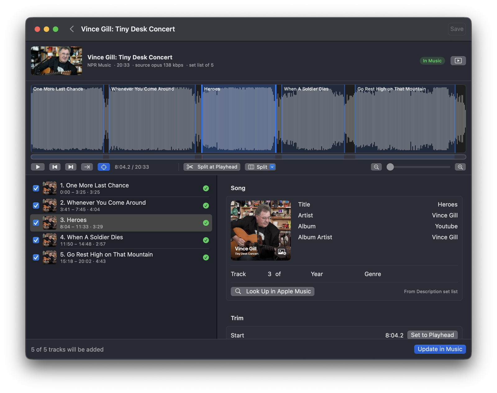
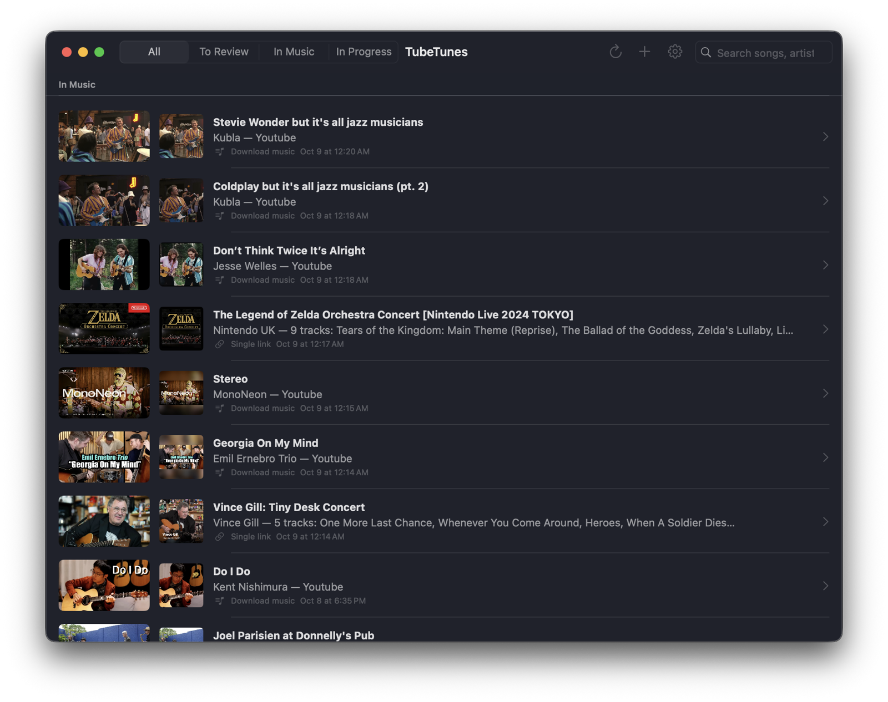
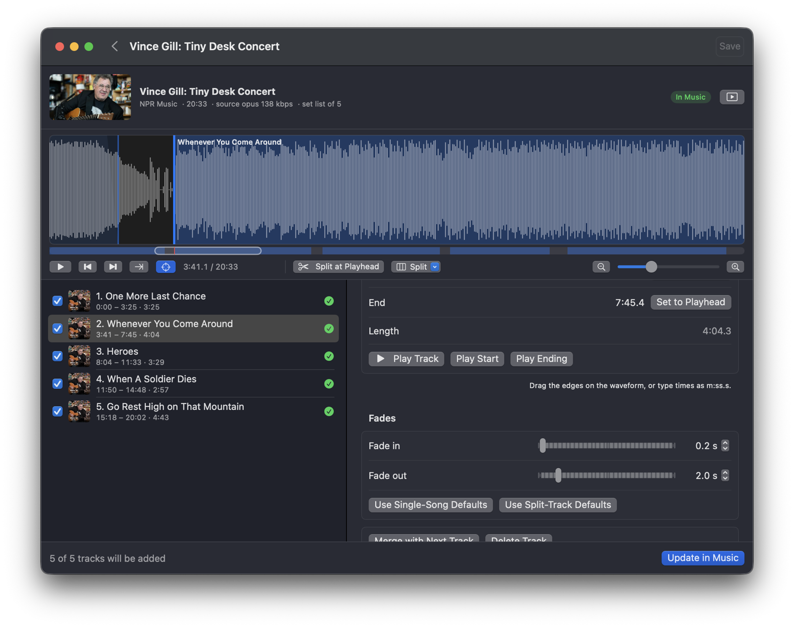
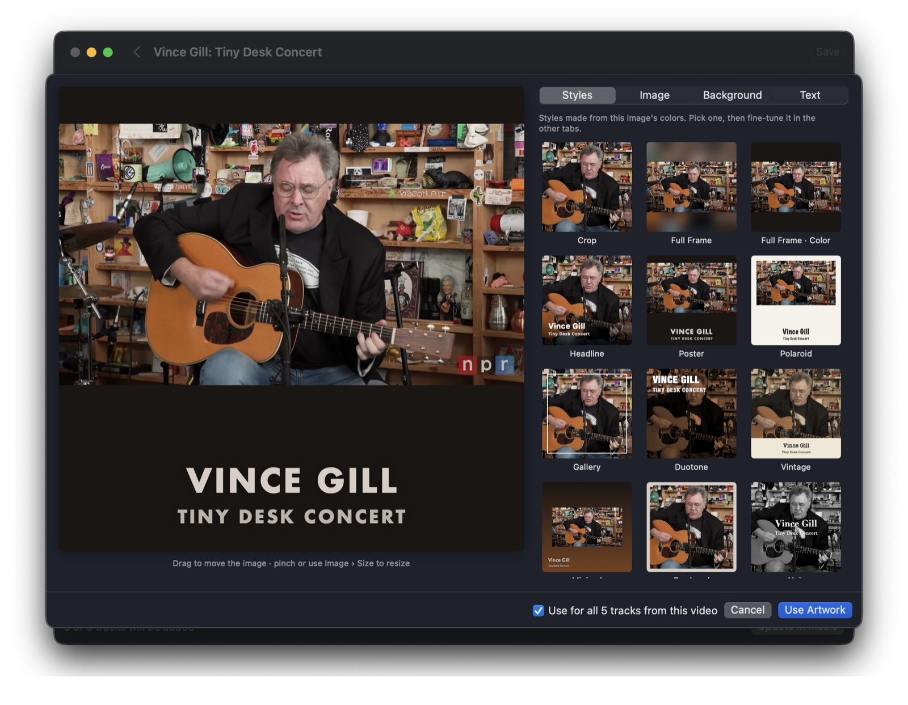
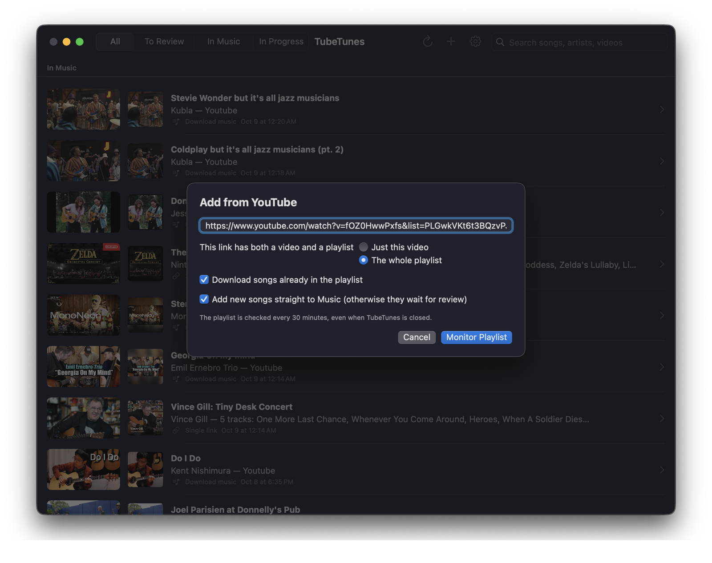
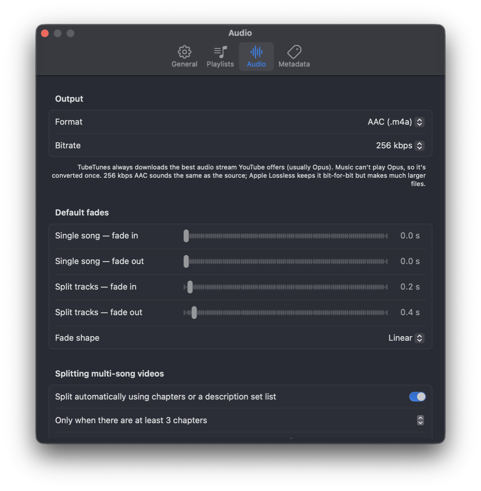

<p align="center">
  
</p>

<h1 align="center">TubeTunes</h1>

<p align="center">
  <b>Turn YouTube videos and playlists into properly tagged songs in Apple Music.</b><br>
  Add a playlist once, and new videos land in your library on their own.
</p>

<p align="center">
  
  
  
</p>

<p align="center">
  
</p>

---

## Playlists that sync themselves

Paste a YouTube playlist and TubeTunes downloads every song in it, then keeps watching. A small background job checks for new videos every 30 minutes, even when the app is closed. New songs get tagged and added to Apple Music without you doing anything. Every video is remembered, so nothing downloads twice.

<p align="center">
  
</p>

## Concerts and full albums, split into songs

Live sets, Tiny Desks and full-album uploads become separate tracks, numbered in the order they're played. TubeTunes can split them using:

- **YouTube chapters**
- **A set list in the description**
- **Detected silence or a known song count**

Then fine-tune on the waveform: pinch to zoom, drag a track's edges, trim intros and outros, and set fades for each song.

<p align="center">
  
</p>

## Album art that looks the part

Pick the YouTube thumbnail or any frame from the video, then fit it in the square or pad it above and below. Choose from a dozen styles generated from the image's own colors (Poster, Polaroid, Headline, Duotone, Vintage, and more), or design your own with backgrounds, borders, filters and text.

<p align="center">
  
</p>

## Metadata that's actually right

TubeTunes reads YouTube Music credits and the video title, then checks the Apple Music catalog. Real studio tracks get their real album, track number, year, genre and cover. Covers and live performances stay credited to the performer and are never misfiled under the original album. Anything that isn't from an album goes into a **"Youtube"** album for that artist, in the order you added it.

| YouTube title | → Song | Artist | Album |
|---|---|---|---|
| Rick Astley - Never Gonna Give You Up (Official Video) (4K Remaster) | Never Gonna Give You Up | Rick Astley | *Whenever You Need Somebody* · track 1 |
| Peg - Steely Dan (Kent Nishimura) | Peg | Kent Nishimura | Youtube *(cover, not filed under Aja)* |
| Emil Ernebro Trio plays "Georgia On My Mind" | Georgia On My Mind | Emil Ernebro Trio | Youtube |
| NORD LIVE: MonoNeon - Stereo | Stereo | MonoNeon | Youtube *(live)* |
| Vince Gill: Tiny Desk Concert | 5 songs from the set list | Vince Gill | Youtube · tracks 1–5 |

## Add anything, tune everything

<table>
  <tr>
    <td width="55%"></td>
    <td width="45%"></td>
  </tr>
  <tr>
    <td>Add a single video or a whole playlist. Choose whether new songs go straight to Music or wait for a quick review.</td>
    <td>The best available audio is converted once to AAC 256 kbps by default, or Apple Lossless. You can also set default fades for single songs and split tracks.</td>
  </tr>
</table>

---

## Quick start

```bash
brew install yt-dlp ffmpeg
git clone https://github.com/WesYarber/TubeTunes.git
cd TubeTunes
scripts/build-app.sh --install
open /Applications/TubeTunes.app
```

Requires macOS 14 or later and the Xcode command-line tools (Swift 5.10+). The first time a song is added, macOS asks to let TubeTunes control Music.

## All features

<details>
<summary><b>Downloading & audio</b></summary>

- Downloads the best audio stream YouTube offers (usually Opus) and converts it once to AAC 256 kbps (or 192/320), or Apple Lossless, in `.m4a`.
- A single video link downloads just that song, even if it isn't on a playlist.
- Optional browser cookies for age-restricted videos or YouTube Premium audio.
- `tubetunes://add?url=<YouTube link>[&review=1][&playlist=1]` adds links from Shortcuts or a bookmarklet.
</details>

<details>
<summary><b>Playlists & background sync</b></summary>

- Each playlist can auto-add to Music or hold new songs for review.
- Every video ID seen is remembered, so nothing downloads twice.
- A per-user launchd agent (`~/Library/LaunchAgents/<bundle id>.sync.plist`) wakes every 5 minutes at background priority, even when the app is quit. It exits within milliseconds unless a playlist is due for its check interval (30 minutes by default) or downloads are queued.
- It skips work in Low Power Mode. While the app is open, the agent leaves the work to the app.
- The agent logs to `~/Library/Logs/TubeTunes-sync.log`. Turn background sync off in Settings › General.
</details>

<details>
<summary><b>Metadata</b></summary>

- Sources: YouTube Music credits, the video title, and the Apple Music catalog (iTunes Search API).
- Studio tracks found in the catalog get their real album, track number, year, genre and official artwork.
- Recognizes covers ("Song - Original Artist (Performer)", "Cover by X", "X plays "Song"") and live performances, and never files them under studio albums.
- Everything else goes into the album **"Youtube"** under that artist. Every track gets a track number, so albums play in order.
- "Look Up in Apple Music" re-checks any single track.
</details>

<details>
<summary><b>Splitting, trimming & fades</b></summary>

- Splits automatically using YouTube chapters, or a "SET LIST" / "Tracklist" in the description (e.g. Tiny Desk).
- "Detect Songs…" finds songs by silence, or by a known number of songs. The second works for live sets with applause.
- Manual edits: split at the playhead (⌘B), merge, delete, or drag the edges on the waveform.
- Fade-in and fade-out for each track, previewed live. Defaults are set separately for single songs and split tracks.
</details>

<details>
<summary><b>Editor</b></summary>

- **Waveform zoom and scroll:** pinch to zoom around your fingers, and swipe or scroll to pan. ⌥-scroll zooms with a mouse, and ⌘+ / ⌘− step the zoom. The overview bar shows and drags the visible part of the video.
- **Playback:** Space plays and pauses. The view follows the playhead like Logic's Catch: scrolling away turns following off, and pressing play turns it back on.
- **Track buttons:**
  - ⏮ goes to the start of the track, or to the previous track when you're already near the start.
  - ⏭ goes to the next track.
  - →| goes to the end of the current track.
- **Undo and saving:** every edit can be undone (⌘Z / ⇧⌘Z). Edits are a draft until you Save (⌘S), and ‹ Back offers Save / Don't Save if anything is unsaved.
- **Update in Music** replaces the songs already in Music.
</details>

<details>
<summary><b>Artwork designer</b></summary>

- **Sources:** the YouTube thumbnail, any frame from the video (downloads up to 1080p), Apple Music catalog art, or a file.
- **Placement:** drag or pinch to position the image. "Fit Whole Image" pads above and below so a full 16:9 thumbnail fits the square.
- **Look:**
  - Backgrounds: blurred image, solid color, or gradient.
  - Borders: edge or inset frame.
  - Filters: black & white, duotone, vintage.
- **Text:** title and subtitle, 12 fonts, size, color, position, a band behind the text, all caps.
- **Saved designs:** each design is saved next to its artwork and reopens exactly as you left it. By default, artwork applies to every track from the video.
</details>

## How it works

- **Downloading:** [yt-dlp](https://github.com/yt-dlp/yt-dlp) downloads the audio, thumbnail and video info.
- **Audio:** [ffmpeg](https://ffmpeg.org) converts the audio and applies trims and fades, and builds the waveform and the video frames.
- **Adding to Music:** the finished `.m4a` gets its tags and cover art, then is added to Music over AppleScript. TubeTunes remembers each track's Music ID, so later edits replace it instead of duplicating it.

Everything lives in `~/Library/Application Support/TubeTunes/`:
- `library.json`: downloads, tracks, playlists, and every video ID already seen.
- `Items/<id>/`: original audio, preview, thumbnail, artwork designs, and the optional video for picking frames.
- `Exports/`: temporary `.m4a` files, deleted once Music has copied them.

## Building

```bash
scripts/build-app.sh            # builds build/TubeTunes.app
scripts/build-app.sh --install  # also copies it to /Applications
```

- **Permissions:** the app is ad-hoc signed, so macOS may ask again to let it control Music after a rebuild.
- **Forking:** the bundle identifier lives only in `Resources/Info.plist`. The build script and the background agent both read it from there.
- **Downloads failing?** YouTube changes often. Update yt-dlp from Settings › General, or with `brew upgrade yt-dlp`.

## Personal use

TubeTunes is meant for building a personal library from videos you have the right to download. Please respect YouTube's Terms of Service and the rights of the artists.
